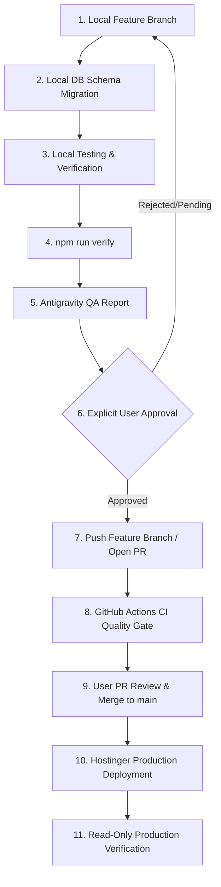

# BLUETORN CRM — Development & Release Workflow Guide

This document defines the mandatory engineering, safety, and release lifecycle for the **BLUETORN CRM** repository.

---

## 1. Master Release Pipeline



---

## 2. Permitted vs. Prohibited Actions

### ✅ What Antigravity May Do Automatically (Local Development)
- Inspect codebase files, configuration, and local schemas.
- Create and edit code on dedicated feature branches (`feature/*`, `fix/*`, `chore/*`).
- Execute local development builds (`npm run build`, `npm run dev`).
- Run local typechecks (`npm run typecheck`).
- Execute local verification suites (`npm run verify`).
- Apply new migration scripts against the **local MySQL database** (`localhost:3306/bluetorn_crm`).
- Run read-only metadata diagnostics when requested.

### 🛑 What Requires Explicit User Approval in Chat
Antigravity must **NEVER** automatically perform any of the following:
- Running `git push` or pushing to any remote branch.
- Pushing to or merging into `main`.
- Opening or merging Pull Requests.
- Triggering production deployments (Hostinger Git auto-deploy, SFTP, SSH, or package uploads).
- Modifying Hostinger web server configurations, Nginx/Passenger settings, or Node.js versions.
- Modifying Hostinger production environment variables.
- Connecting to, querying, or modifying the production database (`u168098130_bluetorn_crm` / `srv2218.hstgr.io`).
- Running database migrations or baselining on production.
- Executing destructive SQL (`DROP`, `TRUNCATE`, `ALTER`, `DELETE`, `UPDATE`) in production.
- Exporting local DB dumps to overwrite production data.

---

## 3. Database Safety Architecture

1. **Local MySQL ≠ Production MySQL**:
   - Local development connects strictly to `localhost:3306/bluetorn_crm`.
   - Production connects strictly to Hostinger Cloud MariaDB (`srv2218.hstgr.io:3306/u168098130_bluetorn_crm`) via Hostinger environment variables.
2. **Zero Overwrite by Dump**:
   - Never import local SQL dumps or test database exports into production.
3. **Migration Immutability**:
   - Historical migrations `001_finance_v1.sql`, `002_team_chat_v1.sql`, `003_team_chat_groups_v1_1.sql`, and `004_leads_configurable_options.sql` are immutable.
   - Future schema updates must always begin sequentially (e.g., `005_*`).
   - All migrations must be forward-only and non-destructive.

---

## 4. Environment Variables & Secrets Discipline

- **Zero Secret Commits**: Never commit `.env`, `.env.local`, production passwords, session secrets, or API keys into git.
- **Local `.env`**: Local development only.
- **Hostinger Environment Variables**: Production only (managed in hPanel → Websites → Node.js → Environment Variables).
- **Production Environment Change Protocol**:
  If a new feature requires an environment variable, Antigravity stops and reports:
  ```markdown
  =============================================
  PRODUCTION ENVIRONMENT CHANGE REQUIRED
  =============================================
  Variable:                <VARIABLE_NAME>
  Reason:                  <Why it is needed>
  Where to configure:      Hostinger hPanel (Node.js -> Environment Variables)
  Secret / value source:   <Safe description - NEVER print secrets>
  Restart/redeploy needed: YES / NO
  =============================================
  ```

---

## 5. Local Verification Gate (`npm run verify`)

Before any release consideration, the local verification gate must pass cleanly:

```bash
npm run verify
```

The verification suite automatically runs 5 mandatory checks:
1. **Environment Safety Guard**: Ensures `DB_HOST` is localhost and cannot touch production.
2. **Migration Immutability Check**: Validates that historical migrations `001`–`004` exist and are intact.
3. **Secrets Leak Prevention**: Checks git index to guarantee no `.env` or sensitive files are staged.
4. **TypeScript Typecheck**: Executes `tsc --noEmit` across all application modules.
5. **Production Build**: Executes `vite build` to guarantee compilation and SSR bundle correctness.

---

## 6. Pre-Push Safety Guard

A Git pre-push hook (`.git/hooks/pre-push` backed by `scripts/git-pre-push.mjs`) protects against accidental pushes directly to `main`.

### Installation on Fresh Clones:
To install or reinstall the pre-push safety hook on any fresh clone:
```bash
npm run setup:hooks
```

### Behavior:
- **Feature branch pushes**: Always allowed (`feature/*`, `fix/*`, `chore/*`).
- **Direct push to `main`**: Automatically blocked.
- **Approved Release Push**:
  For an intentional, user-approved release push to `main`, set the release approval flag:
  - **PowerShell**:
    ```powershell
    Set-Item -Path env:BLUETORN_RELEASE_APPROVED -Value 'true'
    git push origin main
    Remove-Item env:BLUETORN_RELEASE_APPROVED
    ```
  - **Bash / Linux / macOS**:
    ```bash
    BLUETORN_RELEASE_APPROVED=true git push origin main
    ```

---

## 7. Recommended GitHub Branch Protection Settings

To secure the remote repository (`bluetorn03/bluetorn.crm`):

1. Go to **GitHub Repository Settings** → **Branches** → **Add branch protection rule**.
2. Branch name pattern: `main`
3. Check **Require a pull request before merging**.
   *(Note: For single-developer repositories, do not enforce "Require approvals", as GitHub prevents authors from approving their own PRs).*
4. Check **Require status checks to pass before merging**:
   - Status check: `Verify Quality & Build` (from `.github/workflows/verify.yml`).
5. Check **Do not allow bypassing the above settings**.
6. Check **Block force pushes**.
7. Check **Prevent branch deletion**.

---

## 8. Failure Handling & Rollback Procedures

### If Local Tests or Verification Fail
1. Stop immediately.
2. Review error logs output by `npm run verify`.
3. Fix the offending code, types, or configuration on the feature branch.
4. Re-run `npm run verify` until 100% clean.

### If Production Deployment Fails on Hostinger
1. **Fast Application Rollback**:
   - If using Git: Revert `main` to the previous known good commit tag:
     ```bash
     git revert HEAD -m 1
     git push origin main
     ```
   - If using archive upload: Re-upload the previous stable `app.zip` archive.
2. **Hostinger Node.js Process Restart**:
   - In hPanel: Navigate to **Websites** → **Node.js** → Click **Restart Application**.
   - If on VPS: `pm2 reload bluetorn-crm` or `systemctl restart bluetorn-crm`.
3. **Database Recovery**:
   - Production database is protected against auto-mutations. If a forward migration failed, restore the pre-migration snapshot taken immediately before release via phpMyAdmin / MySQL CLI.
